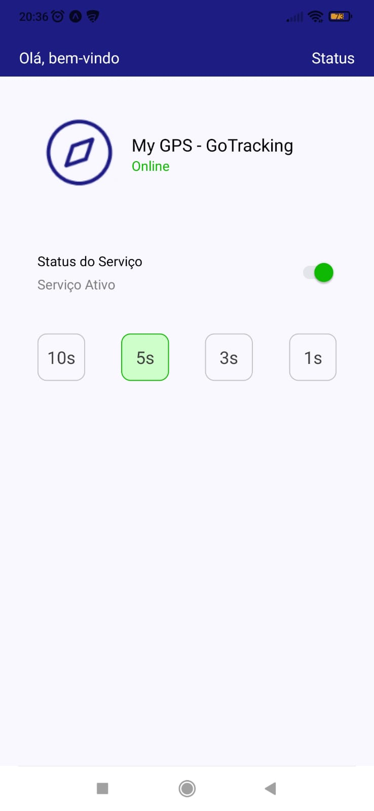
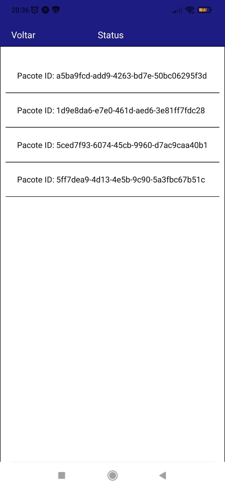

# GoTracking

  

    
    
  

 

## 💻 Projeto

A ideia do GoTracking é criar pacotes e enviar para um servidor, simulando o ambiente offline para guardar os pontos e quando estiver online, enviar para o servidor.

 

## 🚀 Tecnologias

Esse projeto foi desenvolvido com as seguintes tecnologias:

Front-end:

> Desenvolvido usando: React-Native, React-Context, CSS3, Axios, Prettier, ESlint

 

## ⬇️ Instalando dependências

Frontend:

`npm install`

`npm start`

 

Backend:

`Siga o tutorial no link do repositório de Backend`

 

## 📌 Habilidades

Nesse projeto, fui capaz de:

- Aprimorar minhas capacidades no React Native
- Utilizar a geolocalização no React Native
- Utilizar o axios para fazer solicitações ao Backend

 

## 📝 Ajustes e melhorias

O projeto ainda está em desenvolvimento e as próximas atualizações serão voltadas nas seguintes tarefas:

- [ ] Renderizar os cards vindos direto do backend na tela de status
- [ ] Desenvolver a lógica da sincronização com o último status enviado

 

## 🔗 Links

Repositório do Backend:

`https://github.com/contele/contele-vagas/tree/master/react-native`
